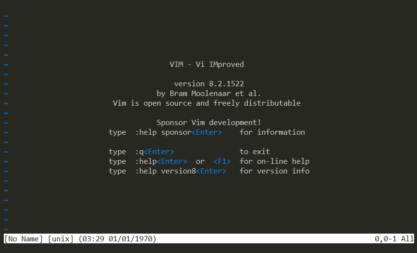

# vim basic commands
you've all heard of VI or vim one of the most famous text editors out there and regardless of what you actually used to, develop software and or write your configuration files in locally on your laptop.

there's a joke says : how do you create a secure password ? stick a noob into a terminal running vim and asked him to quit , we get like a long string of random characters , swear words just about everything else you can imagine but they will not be able to quit the program.

However, using vim is not very difficult

in this manual i show you basic commands of vim

hope you enjoy that!

[start now →](vim-cmd.md)
