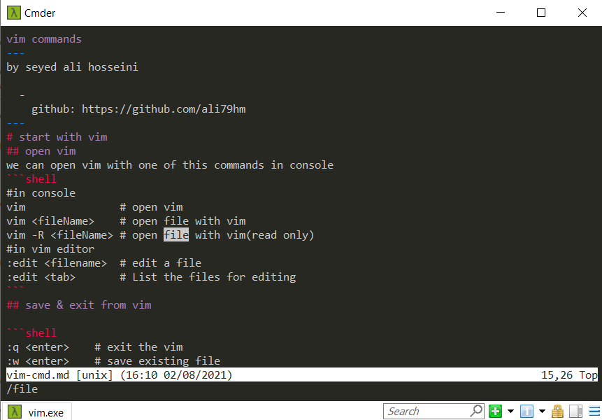
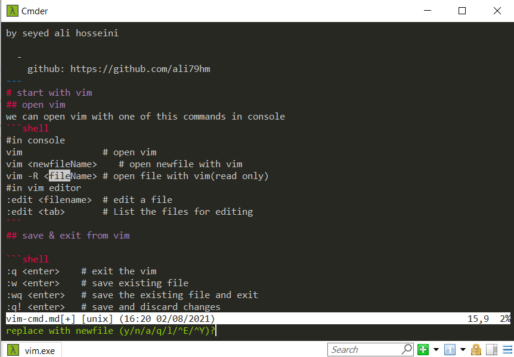
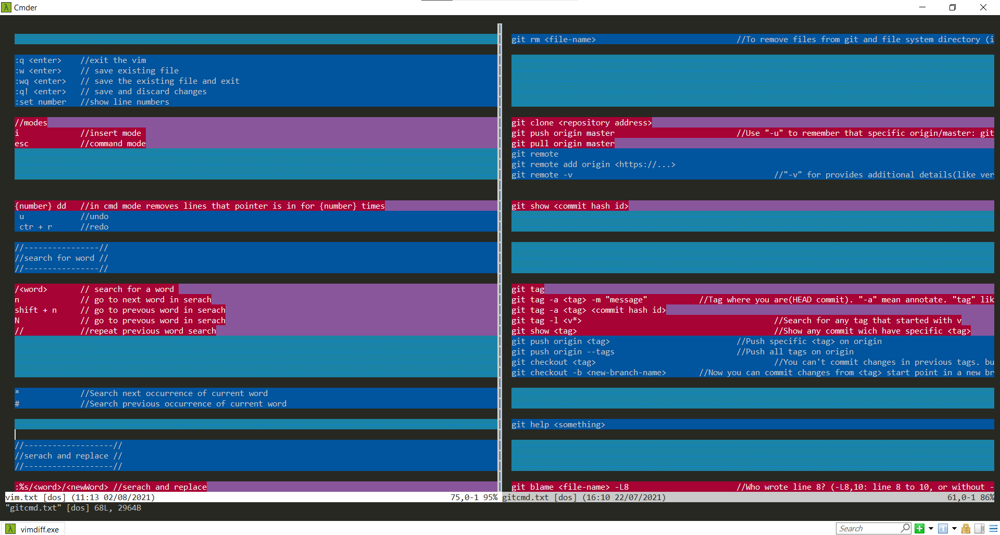

vim commands
---
by seyed ali hosseini

  - 
    github: https://github.com/ali79hm
---
# start with vim
## open vim
we can open vim with one of this commands in console
```shell
#in console
vim               # open vim
vim <fileName>    # open file with vim
vim -R <fileName> # open file with vim(read only)
#in vim editor
:edit <filename>  # edit a file 
:edit <tab>       # List the files for editing
```
## save & exit from vim

```shell 
:q <enter>    # exit the vim 
:w <enter>    # save existing file 
:wq <enter>   # save the existing file and exit 
:q! <enter>   # save and discard changes
```

## see line numbers

```shell
:set number   # show line numbers
```
## undo & redo
```shell
u              # undo 
ctr + r        # redo
```
## remove lines
```shell
{number}dd    # in cmd mode removes lines that pointer is in for {number} times
              # you can use just dd for removing one line
```
# vim mods
## command mode
vim opens in command mode By default but if you switched to other modes 

you can go to command mode by pressing```ecs```on keyboard 

## insert mode
for editing text you should go to insert mode 

press ```i``` on keyboard for going to insert mode

# vim help
```shell
:help
:help <topic-name>
:helpgrep <phrase> # if, you don’t know the exact name of help topic
```


# navigation

## navigate between lines
 
```shell
:<n>  # go to nth line (replace n with number)
:0    # go to start of file
:$    # go to end of file
```

## navigate in lines

```shell
$     # go to end of line
0     # go to beginning of line
w     # Move cursor to the beginning of the next word
e     # Move cursor to the end of the current word
b     # Move cursor to the end of the current word
```

# vim tabs and windows
## tabs
```shell
:tabnew             # Open new tabVim
:tabnew <filename>  # Open new file in tab
:tabclose           # Close current tab
:tabnext            # Move to the next tab
:tabprevious        # Move to the previous tab
:tabfirst           # Move to the first tab
:tablast            # Move to the last tab
```

## windows
```shell
:new                # Open new window
:new <filename>     # Open file in new window
```
for switch between windows press ```ctrl```+```w``` twice (in command mode!)


# search
```shell
/<word>             # search for a word 
n                   # go to next word in serach
shift + n           # go to prevous word in serach
N                   # go to prevous word in serach
//                  # repeat previous word search

*                   # Search next occurrence of current word
#                   # Search previous occurrence of current word
```

# search and replace
```shell
:%s/<word>/<newWord>     #serach and replace
:%s/<word>/<newWord>/g   #serach and replace all
:%s/<word>/<newWord>/gc  #serach and replace all with confirm
```


# files diffrent
```shell
#in console
$ vimdiff <filename> <filename>     //vertical view
$ vimdiff <filename> <filename> -o  //horizental view
#in vim editor
:diffsplit filename                 //horizental view
:vert diffsplit <filename>          //vertical view
```


for switch between files press ```ctrl```+```w``` twice (in command mode!)

---
 - 
 read more in : https://www.tutorialspoint.com/vim/vim_tutorial.pdf
---